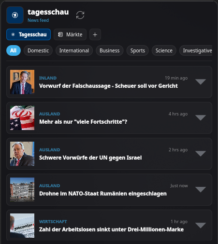

<p align="center">
  
</p>

<h1 align="center">Tagesschau Widget</h1>

<p align="center">
  <a href="https://store.kde.org/p/2360974/">
    
  </a>
  
  <a href="LICENSE">
    
  </a>
  
</p>

<p align="center">
  
  &nbsp;&nbsp;&nbsp;&nbsp;&nbsp;&nbsp;&nbsp;&nbsp;
  
</p>

<p align="center">
  
</p>

A KDE Plasma 6 panel widget for following German news (*Eilmeldungen*), custom RSS feeds, and live stock/crypto prices.

> Mainly aimed at German speakers — the primary news source is [tagesschau.de](https://www.tagesschau.de), most content and categories are in German.

---

## What it does

- **Tagesschau feed** — pulls from the official JSON API, shows headlines, teasers, and breaking news alerts
- **Custom RSS/Atom feeds** — add any feed URL and give it a custom icon
- **Finance board** — live prices for DAX, Dow, NASDAQ, EUR/USD, BTC, ETH, SOL, and a few tech stocks via Yahoo Finance and Binance
- **Breaking news** — if `breakingNews` is set in the API response, the panel icon turns red and you get a desktop notification
- **Expandable articles** — click a card to see the summary inline without opening a browser
- **IPO watchlist** — checks headlines against a list of companies (Anthropic, SpaceX, OpenAI, Stripe, etc.) and notifies you if something matches
- **Category filter** — filter Tagesschau stories by section (Inland, Ausland, Wirtschaft, Sport, Wissen, Investigativ)
- **Auto-refresh** — polls every 5 minutes, or hit the manual refresh button

---

## Requirements

| Dependency | Why |
|---|---|
| KDE Plasma 6.0+ | widget host |
| `plasma5support` | needed for the `executable` DataEngine |
| `libnotify` / `notify-send` | desktop notifications for breaking news and IPO hits |

---

## Install

### Manual

```bash
git clone https://github.com/Muddyblack/kde-tagesschau-rss-widget.git
cd kde-tagesschau-rss-widget
kpackagetool6 -t Plasma/Applet -i package
# update existing install:
kpackagetool6 -t Plasma/Applet -u package
```

Right-click your panel → *Add Widgets* → search **"Tagesschau"**.

Remove:

```bash
kpackagetool6 -t Plasma/Applet -r org.muddyblack.tagesschauWidget
```

### Dev install

```bash
make install
# or
./test_install.sh
```

Installs as a separate test widget so you don't clobber your running one.

Remove test version:

```bash
kpackagetool6 -t Plasma/Applet -r org.muddyblack.tagesschauWidgetTest
rm -f ~/.local/share/icons/hicolor/scalable/apps/org.muddyblack.tagesschauWidgetTest.svg
```

### NixOS (flake)

```nix
{
  inputs.tagesschau-widget.url = "github:Muddyblack/kde-tagesschau-rss-widget";

  outputs = { self, nixpkgs, tagesschau-widget, ... }: {
    nixosConfigurations.mybox = nixpkgs.lib.nixosSystem {
      modules = [
        ({ pkgs, ... }: {
          environment.systemPackages = [
            tagesschau-widget.packages.${pkgs.system}.default
          ];
        })
      ];
    };
  };
}
```

### Pack as `.plasmoid`

```bash
make pack
# produces tagesschau-widget-<version>.plasmoid
```

---

## How it works

**Tagesschau feed** — queries `https://www.tagesschau.de/api2u/homepage` on each refresh. Picks out headlines, teasers, dates, images (`16x9-640`), and the `breakingNews` flag.

**RSS parser** — for custom feeds, fetches the XML, strips namespaces, and pulls title, link, description, date, and any attached images.

**Finance** — crypto comes from Binance (`/api/v3/ticker/24hr`), everything else from Yahoo Finance chart API. Changes are calculated against yesterday's close.

**IPO watch** — every fetch checks titles and descriptions against the watchlist + keywords like `börsengang`, `ipo`, `going public`, `listing`. A match sends a notification.

---

## Development

```bash
make view      # preview in planar mode
make view-h    # preview in horizontal panel
make install   # install test version
make pack      # build .plasmoid archive
```
