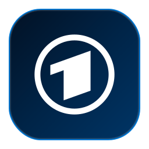
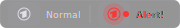
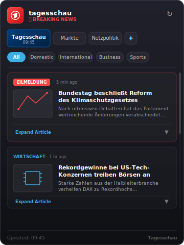

<p align="center">
  
</p>

<h1 align="center">Tagesschau Premium News Widget</h1>

<p align="center">
  <a href="https://github.com/Muddyblack/tagesschau-widget">
    
  </a>
  
  <a href="LICENSE">
    
  </a>
  
</p>

<p align="center">
  
  &nbsp;&nbsp;&nbsp;&nbsp;&nbsp;&nbsp;&nbsp;&nbsp;
  
</p>

A KDE Plasma 6 panel widget for tracking German breaking news (*Eilmeldungen*), custom RSS feeds, and live stock or cryptocurrency prices. Featuring custom desktop notification integrations, an inline expandable article viewer, and a target list IPO watcher.

---

## Features

- **Multi-source Feeds** — Toggle between Tagesschau (JSON API), Markets (Yahoo Finance & Binance), and custom RSS/Atom news feeds.
- **Customizable Icons** — Select custom system icon names (e.g. `brand-bbc`, `chart-line`, `financial`, or custom local SVG names) for each individual feed or ticker directly from the configuration UI.
- **Breaking News Alerts** — Live tracking of German *Eilmeldungen* with a glowing panel icon, pulsing red notification badge, and instant critical desktop notifications.
- **Expandable Articles** — Click news cards inside the popup to expand details inline (showing summary paragraphs, publication dates, and teaser images) without opening a browser.
- **Finance Board** — Real-time price tracking and percentage changes for stock market indices (DAX, Dow Jones, NASDAQ), currencies (EUR/USD), cryptocurrencies (Bitcoin, Ethereum, Solana), and popular technology or aerospace equities.
- **IPO Watch Alerts** — Pinned watch-list of target companies (e.g. Anthropic, SpaceX, OpenAI, Stripe, Klarna, Starlink). If any news item matches an IPO keyword, it triggers a desktop notification.
- **Category Filters** — Quickly narrow down Tagesschau homepage stories by ressort categories (Inland, Ausland, Wirtschaft, Sport, Wissen, or Investigativ).
- **Sleek Glassmorphism** — Gorgeous frosted card styling, border highlights, and smooth, responsive animations tailored for modern Linux Dark Themes.
- **Auto-Refresh** — Periodically polls news feeds and stock details every 5 minutes (configurable), plus a manual refresh action button in the header.

---

## Requirements

| Dependency | Purpose |
|---|---|
| KDE Plasma 6.0+ | Widget host environment (`X-Plasma-API-Minimum-Version: 6.0`) |
| `plasma5support` | Provides the `executable` DataEngine for executing CLI commands |
| `libnotify` / `notify-send` | Triggering critical system notification popups for breaking news or IPO matches |

---

## Install

### Manual (any distro)

```bash
git clone https://github.com/Muddyblack/tagesschau-widget.git
cd tagesschau-widget
kpackagetool6 -t Plasma/Applet -i package
# or to update an existing install:
kpackagetool6 -t Plasma/Applet -u package
```

Then right-click your panel → *Add Widgets* → search **"Tagesschau Premium News"**.

To remove:

```bash
kpackagetool6 -t Plasma/Applet -r org.muddyblack.tagesschauWidget
```

### Development / test install

```bash
make install
# or
./test_install.sh
```

Installs as `Tagesschau Premium News (Test)` alongside the production widget so you can develop without replacing your active install.

To remove the test version:

```bash
kpackagetool6 -t Plasma/Applet -r org.muddyblack.tagesschauWidgetTest
rm -f ~/.local/share/icons/hicolor/scalable/apps/org.muddyblack.tagesschauWidgetTest.svg
```

### NixOS (flake)

```nix
# flake.nix
{
  inputs.tagesschau-widget.url = "github:Muddyblack/tagesschau-widget";

  outputs = { self, nixpkgs, tagesschau-widget, ... }: {
    nixosConfigurations.mybox = nixpkgs.lib.nixosSystem {
      modules = [
        ({ pkgs, ... }: {
          environment.systemPackages = [
            tagesschau-widget.packages.${pkgs.system}.default
          ];
        })
      ];
    };
  };
}
```

### Package as `.plasmoid`

```bash
make pack
# produces tagesschau-widget-<version>.plasmoid
```

---

## How it works

### Tagesschau JSON Homepage Feed
On each refresh cycle, the widget queries `https://www.tagesschau.de/api2u/homepage`. It parses the stories, looking for teaser images (resolving best responsive dimensions, e.g. `16x9-640`), headlines, short descriptions, publication dates, and the `breakingNews` boolean flag. If `breakingNews` is detected, it shifts the widget header and panel icon to alert red and runs `notify-send` to push a critical desktop notification.

### RSS Fallback Parser
When a custom news feed URL is configured, the widget queries the RSS XML endpoint, strips tag namespaces, extracts the title, links, description texts, publication dates, and matches enclosures, thumbnails, or embedded images for visual rendering.

### Finance Stock & Crypto Board
- **Cryptocurrencies**: Directly queries Binance's public REST API (`https://api.binance.com/api/v3/ticker/24hr?symbol=<Symbol>USDT`) for low-latency spot price updates and 24h percentage movements.
- **Indices, Equities & Forex**: Queries Yahoo Finance chart endpoints (`https://query1.finance.yahoo.com/v8/finance/chart/<Symbol>`) using custom browser User-Agents, calculating value changes against yesterday's market close.

### IPO Watch Notifications
Whenever news is fetched, the title and descriptions are matched against a watchlist of high-profile private companies (Anthropic, SpaceX, OpenAI, Stripe, Klarna, Starlink) and IPO keywords (e.g. `börsengang`, `ipo`, `going public`, `listing`). A match triggers a desktop notification saying `📈 IPO Watch: <Company>` along with the news headline.

---

## Development

Use the included Makefile for convenient shortcuts:

- **Preview Widget (Planar)**: `make view`
- **Preview Widget (Horizontal Panel)**: `make view-h`
- **Install Test Version**: `make install`
- **Pack to Plasmoid Archive**: `make pack`
